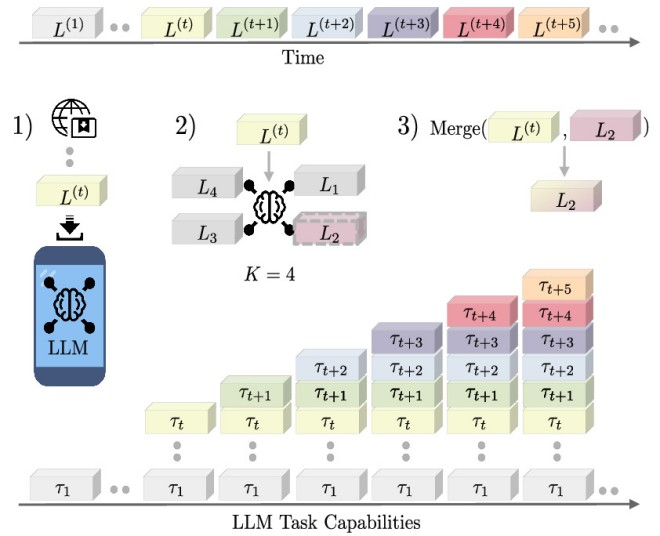

<div align="center">

# K-Merge: Online Continual Merging of Adapters for On-device Large Language Models

[Donald Shenaj](https://donaldssh.github.io/)</a><sup>1,2,3</sup>&nbsp;
[Ondrej Bohdal](https://ondrejbohdal.github.io/)<sup>1</sup>&nbsp;
[Taha Ceritli](https://tahaceritli.github.io/)<sup>1</sup>&nbsp;
[Mete Ozay](https://openreview.net/profile?id=%7EMete_Ozay3)<sup>1</sup>&nbsp;
[Pietro Zanuttigh](https://medialab.dei.unipd.it/members/pietro-zanuttigh/)<sup>3</sup>&nbsp;
[Umberto Michieli](https://umbertomichieli.github.io/)<sup>1</sup>&nbsp;


<sup>1</sup> Samsung R&D Institute UK &nbsp; <sup>2</sup> University of Pisa &nbsp;  <sup>3</sup> University of Padova


**ACL 2026 (main, oral)**

[](https://donaldssh.github.io/K-Merge)
[](https://arxiv.org/abs/2510.13537)
[](#Citation)




</div>

Code coming soon!


## Abstract
On-device deployment of Large Language Models (LLMs) frequently leverages Low-Rank Adapters (LoRAs) to support diverse downstream tasks under tight resource constraints. To address the limited storage capacity of mobile devices, recent works have explored model merging techniques to fuse multiple LoRAs into a single one. In practice, however, LoRAs are often delivered incrementally, as users request support for new tasks (e.g., novel problem types or languages). This scenario introduces a new challenge: on-device online continual merging, where the objective is to incorporate new LoRAs while preserving the performance on previously supported tasks. In this paper, we propose a data-free and computationally efficient strategy for selecting and merging LoRAs when a new one becomes available, assuming the device can store only a limited number of adapters. Extensive experiments across real-world tasks demonstrate the superiority of our approach compared to alternative strategies while adhering to the storage budget and compute limitations of on-device settings. 


## Citation

```
@inproceedings{shenaj2026k,
  title={K-Merge: Online Continual Merging of Adapters for On-device Large Language Models},
  author={Shenaj, Donald and Bohdal, Ondrej and Ceritli, Taha and Ozay, Mete and Zanuttigh, Pietro and Michieli, Umberto},
  booktitle={Proceedings of the 64th Annual Meeting of the Association for Computational Linguistics (ACL),
  year={2026}
}
```
