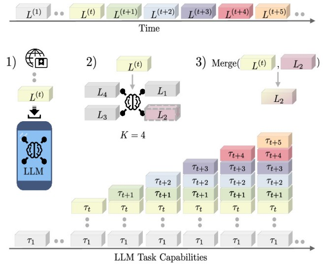

<div align="center">

# K-Merge: Online Continual Merging of Adapters for On-device Large Language Models

[Donald Shenaj](https://donaldssh.github.io/)</a><sup>1,2,3</sup>&nbsp;
[Ondrej Bohdal](https://ondrejbohdal.github.io/)<sup>1</sup>&nbsp;
[Taha Ceritli](https://tahaceritli.github.io/)<sup>1</sup>&nbsp;
[Mete Ozay](https://openreview.net/profile?id=%7EMete_Ozay3)<sup>1</sup>&nbsp;
[Pietro Zanuttigh](https://medialab.dei.unipd.it/members/pietro-zanuttigh/)<sup>3</sup>&nbsp;
[Umberto Michieli](https://umbertomichieli.github.io/)<sup>1</sup>&nbsp;


<sup>1</sup> Samsung R&D Institute UK &nbsp; <sup>2</sup> University of Pisa &nbsp;  <sup>3</sup> University of Padova


**ACL 2026 (main, oral)**

[](https://donaldssh.github.io/K-Merge)
[](https://aclanthology.org/2026.acl-long.137/)
[](https://arxiv.org/abs/2510.13537)
[](https://donaldssh.github.io/K-Merge/presentation.html)
[](#Citation)




</div>

## Abstract
On-device deployment of Large Language Models (LLMs) frequently leverages Low-Rank Adapters (LoRAs) to support diverse downstream tasks under tight resource constraints. To address the limited storage capacity of mobile devices, recent works have explored model merging techniques to fuse multiple LoRAs into a single one. In practice, however, LoRAs are often delivered incrementally, as users request support for new tasks (e.g., novel problem types or languages). This scenario introduces a new challenge: on-device online continual merging, where the objective is to incorporate new LoRAs while preserving the performance on previously supported tasks. In this paper, we propose a data-free and computationally efficient strategy for selecting and merging LoRAs when a new one becomes available, assuming the device can store only a limited number of adapters. Extensive experiments across real-world tasks demonstrate the superiority of our approach compared to alternative strategies while adhering to the storage budget and compute limitations of on-device settings. 


## ⚙️ Setup
We utilize a conda environment which can be created and activated as follows:
```
conda create -n kmerge python=3.9.21
conda activate kmerge
```

We use the following libraries: `torch`, `transformers`, `datasets`, `evaluate`, `accelerate`, `peft`, `rouge-score`, `vllm`, `bitsandbytes`, `nevergrad`, `py7zr`, `errant`, `fugashi`, `jieba`, `sumeval`, `janome`, `ltp`, `markdown`, `pypinyin`, `levenshtein`, `nltk`:
```
pip install torch torchvision torchaudio --index-url https://download.pytorch.org/whl/cu121
pip install transformers
pip install datasets
pip install evaluate
pip install accelerate
pip install peft
pip install rouge-score
pip install vllm
pip install bitsandbytes
pip install nevergrad
pip install py7zr
pip install errant
pip install fugashi
pip install 'fugashi[unidic-lite]'
pip install jieba
pip install sumeval
pip install janome
pip install ltp
pip install markdown
pip install pypinyin
pip install levenshtein
pip install nltk
python -m spacy download en_core_web_sm
python -c "import nltk; nltk.download('punkt'); nltk.download('punkt_tab')"
```

`text-correction` task is not machine-translated into other languages like the other tasks - translating grammar errors would erase them, so each language keeps its own GEC corpus instead. German, Spanish, French, Japanese, and Korean come from the github-typo-corpus:
```
mkdir -p data
cd data
wget -O github-typo-corpus.v1.0.0.jsonl.gz "https://web.archive.org/web/20260217103607/https://github-typo-corpus.s3.amazonaws.com/data/github-typo-corpus.v1.0.0.jsonl.gz"
gunzip github-typo-corpus.v1.0.0.jsonl.gz
cd ..
```

Chinese comes from ECSpell:
```
mkdir -p ECSpell/Data/domains_data
cd ECSpell/Data/domains_data
wget https://raw.githubusercontent.com/aopolin-lv/ECSpell/refs/heads/main/Data/domains_data/law.test
wget https://raw.githubusercontent.com/aopolin-lv/ECSpell/refs/heads/main/Data/domains_data/law.train
wget https://raw.githubusercontent.com/aopolin-lv/ECSpell/refs/heads/main/Data/domains_data/med.test
wget https://raw.githubusercontent.com/aopolin-lv/ECSpell/refs/heads/main/Data/domains_data/med.train
wget https://raw.githubusercontent.com/aopolin-lv/ECSpell/refs/heads/main/Data/domains_data/odw.test
wget https://raw.githubusercontent.com/aopolin-lv/ECSpell/refs/heads/main/Data/domains_data/odw.train
cd ../../..
```

For scoring Chinese `text-correction` predictions we use `ChERRANT`. It can be downloaded from [MuCGEC](https://github.com/HillZhang1999/MuCGEC/tree/main/scorers/ChERRANT) and placed within `ChERRANT` directory.

Italian GEC comes from the MERLIN corpus. It should be placed into `data/gec-it/` directory and can be downloaded from [MultiGEC dataset](https://lt3.ugent.be/resources/multigec-dataset/), with further details about the MultiGEC dataset described [here](https://spraakbanken.github.io/multigec-2025/).

After this run `accelerate config`. We have selected the default options (This machine, No distributed training, NO for CPU only, torch dynamo and DeepSpeed, all GPUs for training, NO for numa efficiency, no mixed precision).

We also need to create directories `output`, `predictions`, `stored_models`, `logs`, `data` in the repo directory:
```
mkdir -p output predictions stored_models logs data
```

Datasets `squad`, `samsum`, and `persona-chat-synthetic` load directly from Hugging Face; `content_rephrasing` (tone variants `professional`/`casual`/`witty`/`paraphrase`, combined into `--tone generic` at load time) needs to be recreated locally, and these four get machine-translated into the other 7 languages - OPUS-MT (`Helsinki-NLP/opus-mt-en-<lang>`) for German, Spanish, French, and Italian, M2M100 (`facebook/m2m100_418M`) for Japanese, Korean, and Chinese. `text-correction` also needs to be recreated locally, but keeps its own GEC corpus per language instead of being translated. Run all of it with:
```
bash scripts/prepare_data.sh
```

## 📚 LoRA Library
We use `scripts/train_loras_llama.sh` and `scripts/train_loras_qwen.sh` to train the attention-only LoRAs:
```
bash scripts/train_loras_llama.sh
bash scripts/train_loras_qwen.sh
```
Each covers 5 tasks x 8 languages (en de es fr it ja ko zh) for its base model:

| Task tag | Dataset |
|---|---|
| `correction` | text-correction |
| `cr` | content_rephrasing (`--tone generic`) |
| `qa` | squad |
| `rp` | persona-chat-synthetic |
| `sum` | samsum |

Before merging, move each model's adapters into `stored_models/llama321b_loras/` or `stored_models/qwen2515b_loras/` respectively.


## 💻 Experiments
Online continual merging experiments are organized under `scripts/`, split by base model:
```
scripts/
├── llama/   # meta-llama/Llama-3.2-1B-Instruct
└── qwen/    # Qwen/Qwen2.5-1.5B-Instruct
```
Each subfolder has one script per merging strategy:

| Script | `--lora_merge_strategy` | Method |
|---|---|---|
| `run_all_k_linear.sh` | `linear` | linear merging |
| `run_all_k_kmerge.sh` | `kmerge` | K-Merge (ours) |
| `run_all_k_kmerge_pp.sh` | `kmerge` + `--threshold_sim` | K-Merge++ (ours) |
| `run_all_k_ties.sh` | `ties` | TIES merging |
| `run_all_k_dare_linear.sh` | `dare_linear` | DARE + linear merging |
| `run_all_k_dare_ties.sh` | `dare_ties` | DARE + TIES merging |
| `run_all_k_opcm.sh` | `opcm` | OPCM |

Each script sweeps every combination of storage budget `k_lora_budget` (1-8) and seed (0, 22, 44), i.e. 24 runs.

Runs are allocated across GPUs and run in parallel, one GPU per background subshell, jobs on the same GPU running sequentially. By default they spread over GPUs `0-7`; override with the `GPUS` env var, e.g. to use only GPUs 0-3:
```
GPUS="0 1 2 3" nohup bash scripts/llama/run_all_k_kmerge.sh > logs/all_k_kmerge.txt 2>&1 &
```

Per-run start/end timestamps and stdout/stderr are logged to `logs/<experiment_name>.txt` (e.g. `logs/k_3_seed_22_kmerge.txt`).

The results of the experiments are stored under `output/<experiment_name>/`.

After the experiments finish, they can be evaluated using `compute_s_score.py`.


## Acknowledgements
Our code extends:
* https://github.com/jzhang38/TinyLlama/blob/main/sft/finetune.py
* https://github.com/huggingface/peft/blob/main/src/peft/tuners/lora/layer.py
* https://github.com/sail-sg/lorahub


<a name="Citation"></a>
## 🔗 Citation
```
@inproceedings{shenaj2026k,
  title={K-merge: Online continual merging of adapters for on-device large language models},
  author={Shenaj, Donald and Bohdal, Ondrej and Ceritli, Taha and Ozay, Mete and Zanuttigh, Pietro and Michieli, Umberto},
  booktitle={Proceedings of the 64th Annual Meeting of the Association for Computational Linguistics (Volume 1: Long Papers)},
  pages={3013--3029},
  year={2026}
}
```
